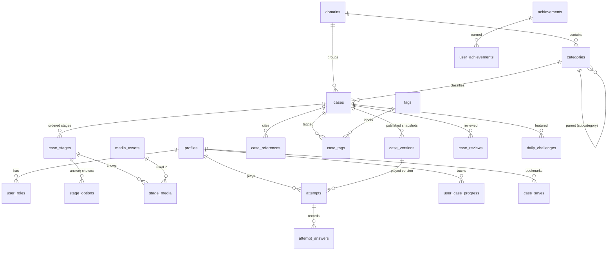

# WiseCases — Milestone 0 Report

**Status:** Architecture proposal, waiting for review. No application code has been written yet.
**Date:** 4 October 2026
**Branch:** `claude/wisecases-architecture-90ek18`
**Interactive version:** [`docs/blueprint/index.html`](blueprint/index.html) — open it in a browser to click through each phase, play a working demo of the case engine and try the case builder.

---

## A. Current repository status

The repository is **completely empty**.

| Check | Result |
|---|---|
| Git status | Branch `claude/wisecases-architecture-90ek18`, no commits yet, no files |
| Project structure | None |
| README / documentation | None |
| `package.json` / dependencies | None |
| Database, auth, deployment config | None |
| Tests / CI | None |
| Security issues | None found (there is nothing to leak or break) |

**What this means for you:** we start clean. There is no old code to migrate, nothing to protect from being overwritten, and no earlier decisions to work around. The stack recommended in the brief can be used as-is.

---

## B. Proposed WiseCases architecture

Three layers, one codebase.

```
┌─────────────────────────────────────────────────────────────┐
│  BROWSER (phone, tablet, laptop) — installable PWA          │
│  Learner app · Admin panel · Public pages                   │
└──────────────────────────────┬──────────────────────────────┘
                               │ HTTPS
┌──────────────────────────────▼──────────────────────────────┐
│  NEXT.JS APP on VERCEL (TypeScript, React, Tailwind)        │
│  • Pages and layouts (public, /play, /admin …)              │
│  • Server actions: start attempt, submit answer, save case  │
│  • CASE ENGINE — one pure TypeScript module, the only place │
│    that decides "correct / wrong / next stage / finished"   │
│  • Zod schemas shared by forms, import, and the server      │
└──────────────────────────────┬──────────────────────────────┘
                               │
┌──────────────────────────────▼──────────────────────────────┐
│  SUPABASE                                                   │
│  • PostgreSQL — all cases, stages, options, attempts        │
│  • Row Level Security — who can read/write which rows       │
│  • Auth — email/password, Google, anonymous guests          │
│  • Storage — clinical images, PDFs (size/type limited)      │
└─────────────────────────────────────────────────────────────┘
```

**Why this shape**

- **One app, not microservices.** A single Next.js project is cheap to host, easy to hand to another developer, and fast to change. Clear folders keep the parts separate.
- **The server keeps score.** Lives, current stage and correctness are decided on the server and stored in the database. The browser never receives the correct answer for a stage until that stage is finished, and never receives future clues early. Refreshing the page cannot restore a lost life.
- **The engine is one small module.** The same engine code runs the real player, the admin "Preview as learner" mode, and the automated tests. Game rules live in exactly one place.
- **Everything is data.** Domains, categories, cases, stages, options, lives and scoring weights come from the database. Adding Case #5,000 needs no developer.
- **Supabase Row Level Security** is a second lock behind the app: even if a page had a bug, the database itself refuses to show drafts to learners or let an editor publish.
- **shadcn/ui-style components** (the same building blocks used across 21st.dev) give a polished, accessible base we own and can restyle in the WiseAitechs brand.

### Folder structure (planned)

```
wisecases/
├── src/
│   ├── app/                      # Next.js routes
│   │   ├── (public)/             # /, /categories, legal pages
│   │   ├── (learner)/            # /play, /case/[slug], /result/[attemptId],
│   │   │                         # /dashboard, /library, /leaderboard, /profile
│   │   ├── admin/                # /admin, /admin/cases, /admin/cases/new,
│   │   │                         # /admin/cases/[id]/edit, /admin/categories,
│   │   │                         # /admin/tags, /admin/review, /admin/analytics,
│   │   │                         # /admin/users
│   │   └── api/                  # import/export, future public API
│   ├── components/
│   │   ├── ui/                   # Button, Card, Badge, Input, Modal, Tabs, Table …
│   │   ├── player/               # LifeIndicator, ProgressDots, ClueStack, AnswerOption
│   │   ├── builder/              # StageEditor, OptionEditor, ReferenceEditor, Readiness
│   │   └── analytics/            # charts and tables
│   ├── lib/
│   │   ├── engine/               # state machine, scoring — pure, fully tested
│   │   ├── schemas/              # Zod: case, stage, option, import format
│   │   ├── db/                   # typed queries, one file per area
│   │   ├── auth/                 # session, role checks
│   │   └── config/               # scoring rules, limits
│   └── styles/
├── supabase/
│   ├── migrations/               # every schema change, numbered, in Git
│   ├── seed.sql                  # 6–8 demo cases, clearly marked DEMO
│   └── tests/                    # RLS policy tests
├── tests/
│   ├── unit/                     # engine, scoring, validation
│   └── e2e/                      # Playwright: admin → learner flows
├── public/                       # icons, manifest, offline page
├── docs/                         # architecture, admin guide, JSON case format
└── .github/workflows/ci.yml      # install, lint, typecheck, test, build
```

---

## C. Database design

Tables are grouped by job. **Content** (what admins write) is kept completely apart from **Gameplay** (what learners did).



| Group | Table | What it holds |
|---|---|---|
| **People & access** | `profiles` | Display name, avatar, streaks. Linked 1:1 to the Supabase login. No email shown publicly. |
| | `user_roles` | SUPER_ADMIN / ADMIN / EDITOR / REVIEWER / LEARNER per user. Only admins can change. |
| **Taxonomy** | `domains` | Medical Diagnosis, Materia Medica, Repertory … (admin-managed). Each has a `domain_type` that unlocks optional fields. |
| | `categories` | Specialty/category, with optional `parent_id` for subcategories. |
| | `tags`, `case_tags` | Free labels, many-to-many. |
| **Content** | `cases` | Title, slug, case number, difficulty, max lives, last-stage rule, reveal rule, status, author, reviewer, version, `domain_fields` (optional JSON for homeopathy/repertory extras, validated by Zod per domain type). |
| | `case_stages` | Ordered stages: title, clue, question, interaction type, hint, explanation, points, life cost, keep-previous-clues flag. Unique `(case_id, position)`. |
| | `stage_options` | Answer choices per stage: label, `is_correct`, position, optional match key (for ordering/matching), accepted synonyms (free text). |
| | `case_references` | Title, authors, source, year, DOI, URL, pages, type, position, `verified` flag. |
| | `media_assets`, `stage_media` | Uploaded file path, type, caption, alt text, credit, licence; attached to stages. |
| **Governance** | `case_versions` | Frozen JSON snapshot every time a case is published. Attempts point here, so editing a live case never breaks someone mid-game or rewrites history. |
| | `case_reviews` | Reviewer decisions and comments. |
| | `audit_logs` | Who did what and when (created, edited, answer changed, published, approved …). Insert-only. |
| **Gameplay** | `attempts` | One play-through: user (or guest), case version, status, current stage, lives left, score, start/finish time, `is_preview`. |
| | `attempt_answers` | Every answer: stage, selected option(s)/text, correct?, lives before/after, time. Drives wrong-answer analytics. |
| | `user_case_progress` | Best result per user per case (fast dashboard and "retry" lists). |
| **Engagement** | `case_saves` | Bookmarks and favourites (`kind` column). |
| | `daily_challenges` | Date → case. Unique per date. |
| | `achievements`, `user_achievements` | Achievement rules and who earned them. |
| | `scoring_rules` | Base score, difficulty multipliers, clue and life weights — editable, not buried in code. |

**Rules applied to every table:** UUID primary keys, foreign keys, `created_at` / `updated_at`, check constraints (e.g. `max_lives between 1 and 20`, `position >= 1`), indexes on every filter used by the library (domain, category, difficulty, status, published_at, tags) and on `attempts(case_id)`, `attempt_answers(stage_id, option_id)`. Cases are **archived, never hard-deleted**, once they have attempts.

---

## D. Case engine design

### Building blocks

- A **case** has `max_lives` (e.g. 3, 5, 7) and an ordered list of **stages** (2, 5, 10 … no limit).
- Each **stage** has its own clue, question, interaction type and **its own answer options** (any number, not fixed at four). Exactly which options are correct is set per stage.
- Each stage has a **life cost** (normally 1; 0 makes a "free" warm-up stage).
- **Keep previous clues visible** is on by default and can be switched off per stage.

### State machine

```
NOT_STARTED
    │ start
    ▼
IN_PROGRESS ◄──────────────────────────────────────────┐
    │ submit answer                                    │
    ▼                                                  │
ANSWER_SUBMITTED                                       │
    ├── correct ─────────────► COMPLETED_SUCCESS       │
    │                                                  │
    └── wrong → lives = lives − stage.life_cost        │
             │                                         │
             ├── lives = 0 ──────► COMPLETED_FAILED    │
             │                                         │
             ├── lives > 0 and a next stage exists     │
             │        → NEXT_STAGE (reveal clue) ──────┤
             │                                         │
             └── lives > 0 and this is the LAST stage  │
                      → STAY_ON_LAST_STAGE ────────────┘
                        (wrong choice is struck out)

Any IN_PROGRESS attempt untouched for 24 h → ABANDONED (kept for analytics).
```

**When stages run out but lives remain (decided, not left open):** by default the learner **stays on the final stage**. The option they just chose is struck out and disabled, and they try again until they are correct or reach zero lives. Because every wrong pick removes one option, this always ends. A case can switch this to **"end the case immediately"** instead (`on_stages_exhausted = 'fail'`).

**When lives run out before the stages do** (e.g. 3 lives, 5 stages): the case ends as failed and the remaining stages are shown in the reasoning review. The builder warns the author: *"With 3 lives, learners can reach at most Stage 3."*

### Scoring (central config, no magic numbers)

```
score = base × difficultyMultiplier × clueEfficiency × lifeMultiplier

clueEfficiency = 1 − clueWeight × (stageSolved − 1) / totalStages
lifeMultiplier = (1 − lifeWeight) + lifeWeight × livesLeft / maxLives
```

Default values (`base 1000`, multipliers Easy 1.0 / Intermediate 1.25 / Hard 1.5, `clueWeight 0.5`, `lifeWeight 0.5`) live in the `scoring_rules` table. Daily and streak bonuses are added on top in Milestone 8.

### Anti-cheating

- `stage_options.is_correct` is **never sent** to the browser before the stage is finished.
- Future stages are **never sent** early.
- Answers go through one server action that loads the attempt, checks it belongs to the caller and is still `IN_PROGRESS`, runs the engine, and saves the result in one database transaction. Double-clicks cannot submit twice (the answer row is unique per attempt + answer number).
- Guests get a Supabase anonymous session, so their attempts are tracked server-side too.

---

## E. Admin panel design — creating a case without coding

1. **Admin → Cases → New case.** A form with plain labels: title, domain, category, difficulty, maximum lives (a − / + stepper), estimated time, tags.
2. **Stages.** "+ Add stage" creates a card. Type the clue, the question, then the answer options. Click **"Correct"** next to the right option(s). Each card has Move up / Move down / Duplicate / Delete (and drag to reorder).
3. **Explanation & teaching.** Final explanation, key clues, differential diagnoses with "why not", learning points. Homeopathy and Repertory domains show extra optional fields (keynotes, modalities, rubrics …) only when that domain is chosen.
4. **References.** Add, remove, reorder. Each reference has a "verified" tick; unverified ones block publishing.
5. **Readiness panel** (always visible) in plain words:
   - ✓ General information
   - ✕ *"Stage 3 has no correct answer."*
   - ⚠ *"With 3 lives, learners can reach at most Stage 3."*
   - ✕ *"1 reference still needs to be verified."*
6. **Autosave:** "Saving…", "Saved", or "Save failed — your changes are kept on this device, retrying".
7. **Preview as learner** plays the case exactly like a learner, using the same engine, without recording statistics.
8. **Status flow:** DRAFT → READY_FOR_REVIEW → REVIEWED → PUBLISHED → ARCHIVED. Editors submit, reviewers approve, only Admin/Super Admin publish.
9. **Duplicate** creates a new draft copy (new ID, new slug, status DRAFT) with all stages, options and references.
10. **Bulk:** documented JSON case format with import preview and validation (CSV later). No manual JSON needed for ordinary case creation.

AI-assisted drafting is designed as a later add-on that only ever produces a **draft**; nothing generated by AI can skip review.

---

## F. Player flow — from opening a case to completion

1. Learner opens `/case/[slug]`. The server checks the case is published and creates an attempt (signed-in or guest).
2. The page shows domain, difficulty, case number, hearts (e.g. ❤️❤️❤️❤️❤️), progress dots and **Stage 1**: the clue, the question and Stage 1's options.
3. Learner picks an option and taps **Submit**.
4. The server runs the engine:
   - **Correct** → attempt saved as COMPLETED_SUCCESS with stage, lives, score, time, wrong picks → **Success screen**.
   - **Wrong** → one life lost (shown with an icon **and** text, not colour alone) → message *"Not quite. One life lost."* → Stage 2's clue slides in beneath the earlier clues, with **new** answer options.
5. This repeats. On the last stage, a wrong answer strikes that option out and the learner tries again (default rule).
6. At **zero lives** → **Out of lives** screen: the correct answer, full explanation, clinical reasoning, important clues, differentials and why they fit less well, learning points, references.
7. Both endings lead to the **Reasoning review** (`/result/[attemptId]`): case summary, *your path* stage by stage, key clues, why the answer fits, why others don't, learning points, references.
8. A **share card** shows clues used, hearts left and stars, never the answer:
   ```
   WiseCases #0241
   🎯 3/5 clues
   ❤️❤️❤️🤍🤍
   ⭐⭐⭐⭐
   ```
9. Refreshing at any point reloads the saved attempt from the server, with the same lives and stage.

---

## G. Development milestones

| # | Milestone | What you will be able to see | Size |
|---|---|---|---|
| 0 | Repository audit & architecture | This report + interactive blueprint | S |
| 1 | Project foundation | App runs; component gallery; CI checks on every push | M |
| 2 | Database + authentication | Sign in, roles, drafts hidden from learners, demo cases loaded | L |
| 3 | Admin Case Builder | Create, edit, preview, duplicate, submit for review, publish | L |
| 4 | Progressive Case Player | Play a case on a phone: hearts, clues, new options per stage | M |
| 5 | Attempt, result & reasoning | Success/failure screens, reasoning review, share card | M |
| — | **First MVP = Milestones 1–5** (the exact workflow in section 53 of the brief) | | |
| 6 | Learner dashboard & library | Stats, filters, search, bookmarks, retry list | M |
| 7 | Admin analytics & bulk import | Wrong-answer charts, difficult cases, JSON/CSV import with preview | M |
| 8 | Gamification | Scoring config, streaks, achievements, daily case, leaderboard | M |
| 9 | PWA / offline | Install on phone, works offline for already-loaded content | S |
| 10 | Security, performance, accessibility | Lighthouse and accessibility audits, rate limits, review of RLS | M |
| 11 | Testing | Full unit, database-policy and end-to-end test suites | M |
| 12 | Production deployment | Live site on Vercel + Supabase, backups, monitoring, launch checklist | S |

Tests are written alongside each milestone; Milestone 11 closes the gaps and adds the full end-to-end suite.

---

## H. Files expected to be created or modified

Milestone 0 (this step) created only:

- `docs/MILESTONE-0-REPORT.md` — this report
- `docs/blueprint/index.html` — interactive visual blueprint (phases, engine demo, builder demo, database explorer)
- `README.md` — short pointer to the above

Milestone 1 will create (nothing existing is modified, because the repo was empty):

- `package.json`, `package-lock.json`, `tsconfig.json`, `next.config.ts`, `tailwind` config, `postcss.config.mjs`, `eslint.config.mjs`, `.prettierrc`
- `.gitignore`, `.env.example`, `.nvmrc`
- `src/app/layout.tsx`, `src/app/page.tsx`, `src/app/dev/ui/page.tsx` (component gallery)
- `src/components/ui/*` (Button, Card, Badge, Input, Select, Modal, Toast, Dialog, Tabs, Table, Pagination, Breadcrumb, Skeleton, EmptyState, ErrorState)
- `src/components/player/LifeIndicator.tsx`, `ProgressDots.tsx`, `AnswerOption.tsx`
- `src/lib/engine/` (state machine + scoring + tests — written early because everything depends on it)
- `vitest.config.ts`, `playwright.config.ts`
- `.github/workflows/ci.yml`
- `README.md` (full), `ARCHITECTURE.md`, `CONTRIBUTING.md`, `CHANGELOG.md`, `SECURITY.md`

Milestone 2 adds `supabase/config.toml`, `supabase/migrations/*.sql`, `supabase/seed.sql`, `supabase/tests/*.sql`, `src/lib/db/*`, `src/lib/auth/*`, `DATABASE.md`.

---

## I. Risks and decisions needed

**Decisions that need you** (everything else uses the defaults described above):

1. **Licence.** Should the code be private/proprietary (recommended for a commercial product) or open source (e.g. MIT)? Case content stays in the database either way and is not published with the code.
2. **Accounts.** Who owns the Supabase and Vercel accounts? You will need to create both (free tiers are enough to start) and add me as a collaborator or give the project keys through environment settings, never in chat or Git.
3. **Google sign-in.** Do you want it in the MVP? It needs a Google Cloud OAuth client set up under your organisation. Email/password and guest play work without it.
4. **Who publishes at launch.** Is it only you (Super Admin), or do you already have named reviewers? This decides how strict the review step is on day one.

**Risks I am managing**

| Risk | How it is handled |
|---|---|
| Learners reading answers from the browser | Correct flags and future clues never leave the server early |
| A case edited while people are playing it | Attempts are tied to a published snapshot (`case_versions`) |
| Inaccurate medical content | Review workflow, verified-reference tick, visible review status, disclaimer |
| Fabricated references | Demo references are marked as placeholders; publishing blocked until verified |
| Slow library with thousands of cases | Server-side filtering, pagination, database indexes |
| Offline answers creating duplicates | Offline attempts disabled until a sync design is approved (Milestone 9) |
| Copyright | Original UI, original content, no Doctordle material |

---

## J. Next action

**Recommended first step: Milestone 1 — project foundation.**

Set up the Next.js + TypeScript + Tailwind project, the WiseAitechs-branded component library, CI (lint, typecheck, test, build), and write the **case engine module with its tests first**, because the player, the admin preview and the analytics all depend on it. Nothing in Milestone 1 needs Supabase accounts yet, so it can start while you answer the decisions above.

I will stop here until you have reviewed this architecture.
